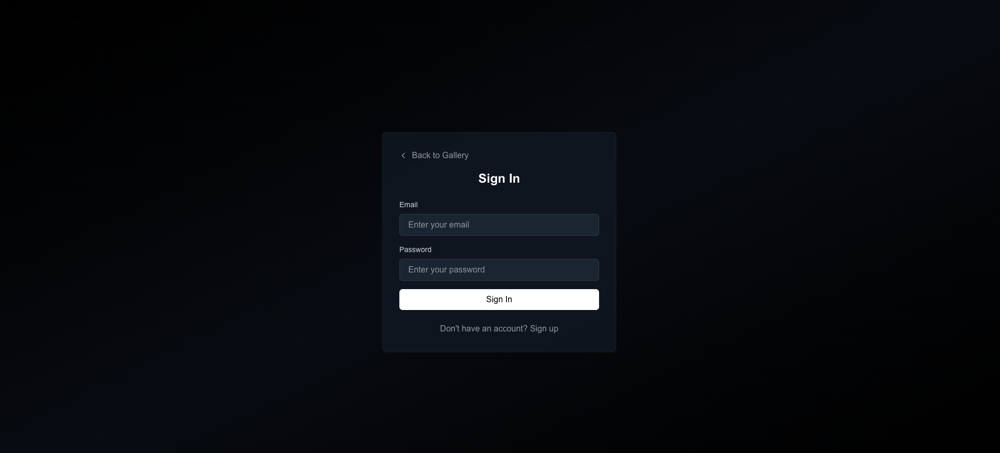
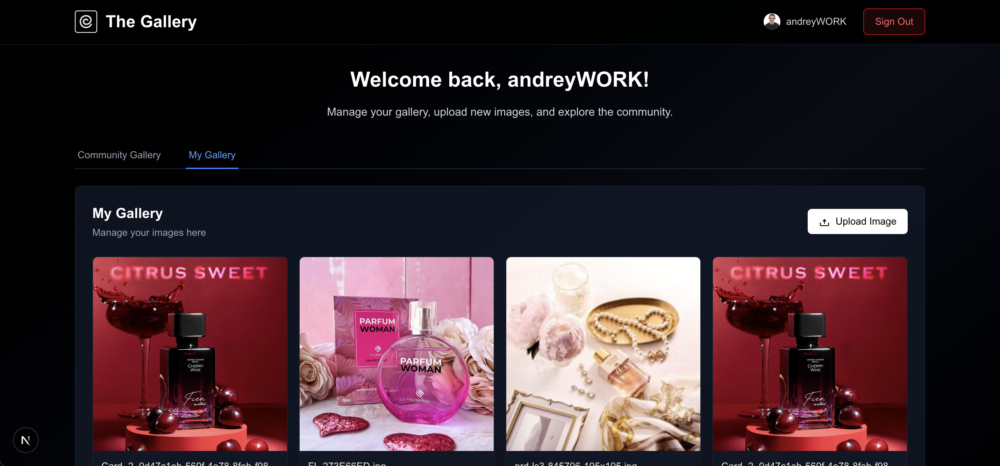
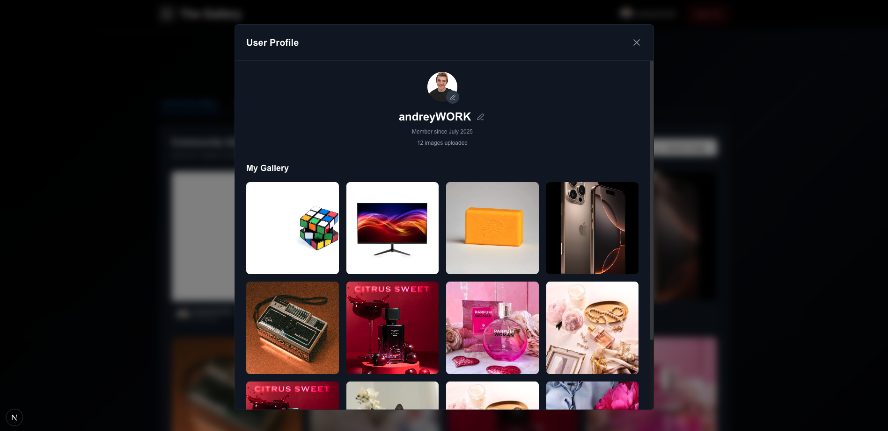
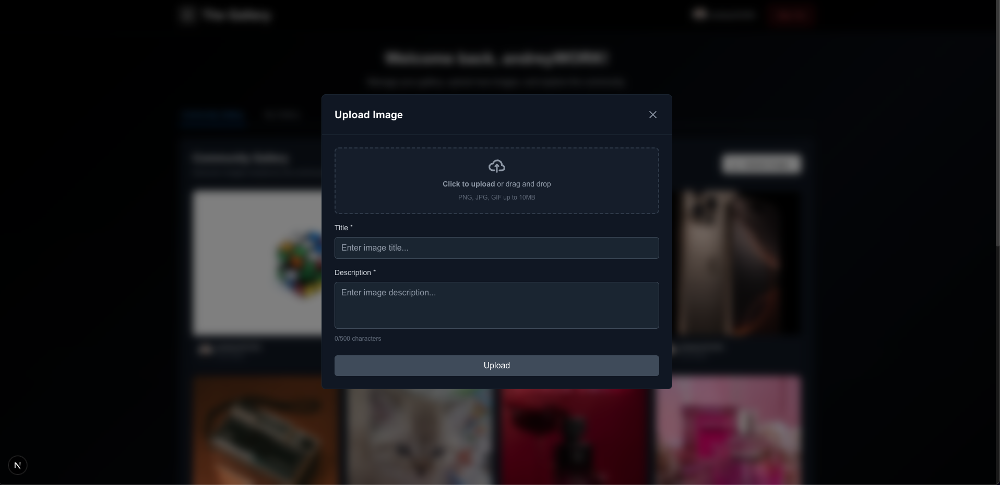

# 🖼️ Gallery App

<div align="center">
  
  
  <h3>A Modern Full-Stack Image Gallery Platform</h3>
  
  <p>
    <strong>Built with Next.js 15, TypeScript, Tailwind CSS, and Supabase</strong>
  </p>
  
  <p>
    A sleek, responsive gallery application that allows users to upload, organize, and share their images in a beautiful community-driven platform.
  </p>

  <div>
    
    
    
    
  </div>
</div>

---

---

## 📸 Screenshots

<div align="center">

### 🔐 Authentication & Login

<br/><em>Secure authentication with email/password and elegant dark theme</em>

### 🖼️ Community Gallery

<br/><em>Explore and discover beautiful images from the community</em>

### 👤 User Profiles

<br/><em>Personalized user profiles with avatar generation and gallery management</em>

### 📤 Image Upload

<br/><em>Intuitive drag-and-drop upload with metadata management</em>

</div>

---

## 🚀 Features

### ✨ User Experience
- 🖼️ **Smart Image Gallery** - Browse personal and community galleries with hover effects and detailed view modals
- 📤 **Drag & Drop Upload** - Effortless image upload with real-time progress tracking and metadata editing
- 🌙 **Dark Theme Design** - Elegant dark interface with gradient backgrounds and smooth animations
- 👤 **Dynamic User Profiles** - Auto-generated gradient avatars and comprehensive profile management
- 📱 **Mobile-First Responsive** - Seamless experience across all devices and screen sizes
- 🔍 **Image Detail Modals** - Full-screen image viewing with creator info, descriptions, and engagement options

### 🔐 Authentication & Security
- �️ **Secure Authentication** - Email/password authentication with Supabase Auth and JWT tokens
- � **Row Level Security** - Database-level security with PostgreSQL RLS policies
- � **User Management** - Complete user profile system with avatar generation
- 🚪 **Protected Routes** - Secure access control for authenticated and public content

### 🏗️ Technical Excellence
- ⚡ **Next.js 15 App Router** - Latest React features with Server Components and optimal performance
- 🎯 **TypeScript Excellence** - Full type safety with strict TypeScript implementation
- 🎨 **Tailwind CSS** - Utility-first styling with custom components and responsive design
- �️ **Supabase Backend** - Complete BaaS with PostgreSQL, real-time subscriptions, and file storage
- 🔄 **Real-time Updates** - Live data synchronization and instant UI updates

## 🛠️ Tech Stack

<div align="center">

| Category | Technologies |
|----------|-------------|
| **Frontend** |     |
| **Backend** |   |
| **Authentication** |   |
| **Storage** |  |
| **Development** |   |

</div>

### 🎯 Architecture Highlights

- **🏗️ Next.js 15 App Router** - Modern React framework with Server Components, App Router, and optimal performance
- **🔒 Supabase Backend** - Complete backend-as-a-service with PostgreSQL database, authentication, and real-time capabilities
- **🎨 Tailwind CSS** - Utility-first CSS framework for rapid, responsive UI development
- **📘 TypeScript** - Full type safety across the entire application stack
- **🛡️ Row Level Security** - Database-level security policies for data protection

## 🚀 Quick Start

### 📋 Prerequisites

Ensure you have the following installed:

- **Node.js** `18.0.0+` - [Download here](https://nodejs.org/)
- **Package Manager** - npm, yarn, pnpm, or bun
- **Supabase Account** - [Create account](https://supabase.com)

### ⚡ Installation

1. **Clone the repository**
```bash
git clone https://github.com/AndreyPetkov03/gallery-app.git
cd gallery-app
```

2. **Install dependencies**
```bash
npm install
# or yarn install / pnpm install / bun install
```

3. **Set up environment variables**

Create a `.env.local` file in the root directory:
```env
NEXT_PUBLIC_SUPABASE_URL=your_supabase_url_here
NEXT_PUBLIC_SUPABASE_ANON_KEY=your_supabase_anon_key_here
```

4. **Set up Supabase database**
   - Create a new project at [supabase.com](https://supabase.com)
   - Go to SQL Editor and run the contents of `supabase-setup.sql`
   - Get your URL and anon key from Settings → API

5. **Start the development server**
```bash
npm run dev
```

6. **Open your browser**
   
   Navigate to [http://localhost:3000](http://localhost:3000) 🎉

---

## 📁 Project Structure

```
gallery-app/
├── 📂 public/                    # Static assets and images
│   ├── 🖼️ galleryGalleries.png  # Community gallery screenshot
│   ├── 🖼️ galleryLogin.png      # Login page screenshot
│   ├── 🖼️ galleryProfile.png    # Profile page screenshot
│   ├── 🖼️ galleryUpload.png     # Upload interface screenshot
│   └── 🎨 Gallery Logo.svg      # Application logo
├── 📂 src/
│   ├── 📂 app/                   # Next.js App Router
│   │   ├── 📄 layout.tsx         # Root layout
│   │   ├── 📄 page.tsx          # Home page
│   │   ├── 📄 globals.css       # Global styles
│   │   └── 📂 dashboard/
│   │       └── 📄 page.tsx      # User dashboard
│   ├── 📂 components/           # React components
│   │   ├── 🔐 AuthProvider.tsx   # Authentication context
│   │   ├── 📝 AuthForm.tsx       # Login/signup forms
│   │   ├── 🖼️ ImageGallery.tsx   # Personal gallery
│   │   ├── 🌍 SharedGallery.tsx  # Community gallery
│   │   ├── 📤 ImageUpload.tsx    # Upload functionality
│   │   ├── 🎨 ImageDetailModal.tsx # Image detail view
│   │   ├── 👤 UserAvatar.tsx     # User avatar component
│   │   ├── 🏠 UserDashboard.tsx  # Main dashboard
│   │   └── ⚡ LoadingSpinner.tsx # Loading component
│   ├── 📂 lib/
│   │   └── 🔧 supabase.ts       # Supabase configuration
│   └── 📂 types/
│       └── 📘 index.ts          # TypeScript definitions
├── 🗄️ supabase-setup.sql       # Database setup script
├── ⚙️ next.config.ts           # Next.js configuration
├── 🎨 tailwind.config.ts       # Tailwind configuration
├── 📘 tsconfig.json            # TypeScript configuration
└── 📦 package.json             # Dependencies and scripts
```

## 🏗️ Key Features Deep Dive

### 🖼️ Gallery Management
- **Personal Gallery**: Upload and manage your private image collection
- **Community Discovery**: Browse and explore images shared by other users
- **Image Detail Modals**: Full-screen viewing with metadata, creator info, and descriptions
- **Responsive Grid Layout**: Optimized viewing experience across all devices

### 🔐 Authentication System
- **Secure Registration**: Email/password authentication with Supabase Auth
- **Profile Management**: Automatic profile creation with customizable user information
- **JWT Token Management**: Secure session handling with automatic token refresh
- **Protected Routes**: Role-based access control for authenticated content

### 📤 Upload Experience
- **Drag & Drop Interface**: Intuitive file upload with visual feedback
- **Metadata Management**: Add titles, descriptions, and tags to your images
- **Progress Tracking**: Real-time upload progress with status indicators
- **File Validation**: Automatic type checking and size optimization

### 👤 User Profiles
- **Auto-Generated Avatars**: Beautiful gradient-based profile pictures
- **Profile Customization**: Edit username, bio, and contact information
- **Gallery Showcase**: Display your best images on your profile
- **User Discovery**: Browse other users' profiles and galleries

---

## 🎨 Design System

### Color Palette
- **Primary**: Dark theme with gray-900 backgrounds
- **Accents**: Blue highlights for interactive elements
- **Success**: Green for confirmations and success states
- **Error**: Red for error states and warnings

### Typography
- **Headings**: Inter font family with various weights
- **Body**: Optimized readability with proper line heights
- **Code**: Monospace fonts for technical content

### Components
- **Responsive Grid**: CSS Grid and Flexbox for layout
- **Hover Effects**: Smooth transitions and micro-interactions
- **Loading States**: Skeleton loaders and spinners
- **Modal System**: Accessible overlay components

---

## 🛡️ Security & Performance

### Security Features
- 🔒 **Row Level Security**: Database-level access control with PostgreSQL RLS
- 🔑 **JWT Authentication**: Secure token-based authentication system
- 🛡️ **Input Validation**: Client and server-side data validation
- 🌐 **HTTPS Enforcement**: Secure data transmission protocols
- 🔐 **Environment Security**: Secure configuration management

### Performance Optimizations
- ⚡ **Server Components**: Reduced client-side JavaScript bundle
- 🖼️ **Image Optimization**: Automatic compression and lazy loading
- 📦 **Code Splitting**: Dynamic imports for faster page loads
- 🗄️ **Database Indexing**: Optimized queries for fast data retrieval
- 💾 **Caching Strategy**: Strategic caching for improved performance

---

## 📚 Learn More

### 🎓 Documentation & Resources

<div align="center">

| Technology | Official Docs | Learn More |
|------------|---------------|------------|
| **Next.js** | [📖 Docs](https://nextjs.org/docs) | [🎯 Learn Next.js](https://nextjs.org/learn) |
| **Supabase** | [📖 Docs](https://supabase.com/docs) | [🚀 Quick Start](https://supabase.com/docs/guides/getting-started) |
| **Tailwind CSS** | [📖 Docs](https://tailwindcss.com/docs) | [🎨 Components](https://tailwindui.com/) |
| **TypeScript** | [📖 Docs](https://www.typescriptlang.org/docs) | [📘 Handbook](https://www.typescriptlang.org/docs/handbook/intro.html) |

</div>

### 🔗 Helpful Links
- [React Documentation](https://react.dev) - Learn React fundamentals
- [PostgreSQL Docs](https://www.postgresql.org/docs/) - Database management

---

## 🤝 Contributing

We welcome contributions from the community! Here's how you can help:

### 🚀 Getting Started
1. **Fork** the repository
2. **Clone** your fork locally
3. **Create** a feature branch (`git checkout -b feature/amazing-feature`)
4. **Make** your changes
5. **Test** thoroughly
6. **Commit** your changes (`git commit -m 'Add amazing feature'`)
7. **Push** to your branch (`git push origin feature/amazing-feature`)
8. **Open** a Pull Request

### 🎯 Development Guidelines
- Follow existing code style and conventions
- Add tests for new features
- Update documentation as needed
- Ensure all tests pass before submitting

### 🐛 Report Issues
Found a bug? Have a feature request? Please open an issue with:
- Clear description of the problem
- Steps to reproduce
- Expected vs actual behavior
- Screenshots if applicable

---

## 🌟 Roadmap

### Upcoming Features
- [ ] **Advanced Search** - Filter images by tags, date, and user
- [ ] **Image Collections** - Create and organize image albums
- [ ] **Social Features** - Like, comment, and follow users
- [ ] **Advanced Upload** - Bulk upload and batch editing
- [ ] **API Integration** - RESTful API for third-party access

### Performance Improvements
- [ ] **Image CDN** - Global content delivery network
- [ ] **Progressive Loading** - Enhanced image loading strategies
- [ ] **Offline Support** - PWA capabilities for offline access

---

##  Development

### Available Commands

```bash
# Development
npm run dev          # Start development server
npm run build        # Build for production
npm run start        # Start production server

# Code Quality
npm run lint         # Run ESLint
```

### Development Workflow

1. **🛠️ Setup**: Clone repo and install dependencies
2. **🗄️ Database**: Configure Supabase and run setup script
3. **💻 Develop**: Start dev server and begin coding
4. **🧪 Test**: Run linting and type checking

---

##  License

This project is licensed under the **MIT License** - see the [LICENSE](LICENSE) file for details.

---

## 👨‍💻 Author

<div align="center">
  <h3>Andrey Petkov</h3>
  
  [](https://github.com/AndreyPetkov03)
  [](mailto:andrey.petkov@example.com)
  
  <p><em>Full-Stack Developer passionate about modern web technologies</em></p>
</div>

---

## 🙏 Acknowledgments

Special thanks to the amazing teams and technologies that made this project possible:

<div align="center">

| Technology | Contribution |
|------------|-------------|
| **Next.js** | Revolutionary React framework with App Router |
| **Supabase** | Complete backend-as-a-service platform |
| **Tailwind CSS** | Beautiful utility-first CSS framework |
| **TypeScript** | Enhanced development with static typing |

</div>

### 🌟 Community
- Thank you to all contributors and users who help improve this project
- Special appreciation for the open-source community
- Inspired by modern design patterns and user experience principles

---

<div align="center">
  <h3>⭐ If you found this project helpful, please give it a star! ⭐</h3>
  
  <p>
    <strong>Built with ❤️ using modern web technologies</strong>
  </p>
  
  <p>
    
    
  </p>
</div>
